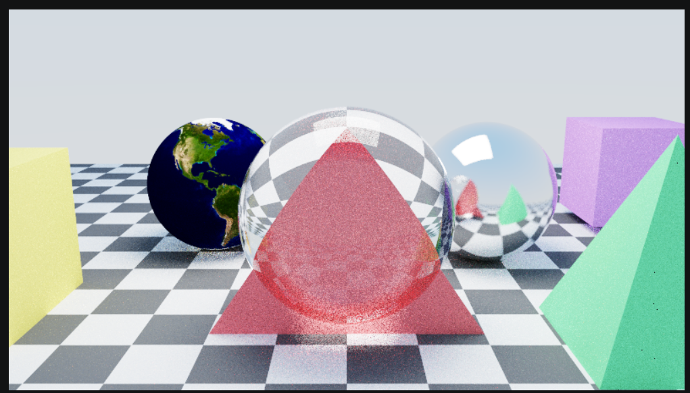

# Custom Ray Tracing Engine in C++


A custom **CPU-based Ray Tracing Engine** built in modern **C++** using **CMake**. Starting from the *Ray Tracing* book series by **Peter Shirley**, this project has been extended with custom rendering features, geometric primitives, texture mapping, camera enhancements, and OBJ model loading to explore physically based rendering and computer graphics.

> **Acknowledgement:** This project is based on the excellent **Ray Tracing** book series by **Peter Shirley**. The renderer has been extended with additional features and custom implementations as part of my learning journey toward building my own ray tracing engine.

<p align="center">
  
</p>

---

# 🖼 Gallery

## Featured Render

<p align="center">
  
</p>

### Features showcased in this render

- 🌍 Earth Texture Mapping
- 🔺 Triangle Primitive
- 🔷 Pyramid Primitive
- 🟪 Procedural Cube
- 📦 OBJ Mesh Loader
- 💎 Glass Material
- ⚙️ Metal Material
- ♟️ Checker Ground Texture
- 🎨 ACES Filmic Tone Mapping
- 📷 Camera Roll & Exposure Control
- ☁️ Gradient Sky

---

# ✨ Features

## Rendering

- CPU Ray Tracing
- Recursive Path Tracing
- Physically Based Rendering
- Lambertian Material
- Metal Material
- Dielectric (Glass) Material
- Anti-Aliasing
- Depth of Field
- Gradient Sky
- Exposure Control
- ACES Filmic Tone Mapping

## Geometry

- Sphere
- Quad
- Triangle *(Custom)*
- Pyramid *(Custom)*
- Procedural Cube *(Custom)*
- OBJ Mesh Loader *(Custom)*

## Texturing

- Checker Texture
- Earth Image Texture Mapping

## Camera

- Camera Roll
- Adjustable Field of View
- Depth of Field

## Engine

- Modular Renderer Design
- CMake Build System
- Modern C++ Architecture

---

# 🚀 Implemented Features

- ✅ Custom Scene
- ✅ Camera Roll
- ✅ Exposure Control
- ✅ ACES Filmic Tone Mapping
- ✅ Gradient Sky
- ✅ Triangle Primitive
- ✅ Pyramid Primitive
- ✅ Procedural Cube Primitive
- ✅ OBJ Mesh Loader
- ✅ OBJ Position & Scale Support
- ✅ Checker Ground Texture
- ✅ Earth Texture Mapping

---

# 🛠 Tech Stack

- C++
- CMake
- MinGW GCC
- Visual Studio Code
- Git
- GitHub

---

# 📁 Project Structure

```text
Ray_Tracing/
│
├── books/
├── build/
├── images/
├── src/
│   ├── external/
│   ├── InOneWeekend/
│   ├── TheNextWeek/
│   └── TheRestOfYourLife/
│
├── CMakeLists.txt
└── README.md
```

---

# 🚀 Getting Started

## Clone Repository

```bash
git clone https://github.com/AlajingiGanesh/Ray_Tracing.git
cd Ray_Tracing
```

## Build

```bash
mkdir build
cd build

cmake .. -G "MinGW Makefiles"
cmake --build .
```

## Run

```bash
.\theRestOfYourLife.exe > image.ppm
```

---

# 📌 Future Improvements

- HDR Environment Lighting
- Skybox Rendering
- Motion Blur
- Soft Shadows
- Multithreaded Rendering
- Progressive Rendering
- BVH Performance Optimization
- Direct PNG Export
- Performance Statistics

---

# 📊 Repository Information

| Category | Details |
|----------|----------|
| Language | C++ |
| Rendering | CPU Path Tracing |
| Build System | CMake |
| Compiler | MinGW GCC |
| IDE | Visual Studio Code |
| Platform | Windows |

---

# 🙏 Acknowledgements

Special thanks to **Peter Shirley** for creating the outstanding **Ray Tracing** book series, which provided the educational foundation for this project.

This repository represents my exploration of rendering techniques and computer graphics by extending the original implementation with additional rendering features, custom primitives, texture support, and engine enhancements.

---

## ⭐ If you found this project interesting, consider giving it a star!
