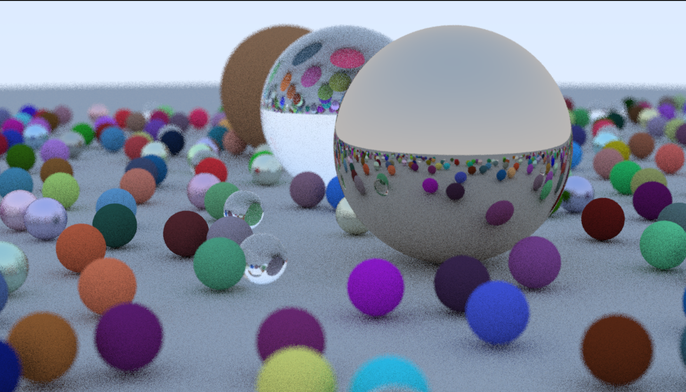

# Ray Tracing in C++ | Learning & Custom Renderer

A modern C++ ray tracing project built while learning computer graphics and physically based rendering. This repository documents my journey from understanding the fundamentals of ray tracing to gradually developing my own custom renderer.

> **Note:** This project is based on the excellent **Ray Tracing in One Weekend** book series by Peter Shirley. The goal of this repository is to learn, experiment, extend, and build new rendering features while documenting my progress.


<p align="center">
  
</p>
---

## ✨ Features

- CPU-based Ray Tracer
- Physically Based Rendering (PBR Concepts)
- Diffuse (Lambertian) Materials
- Metal Materials
- Dielectric (Glass) Materials
- Recursive Ray Tracing
- Anti-Aliasing
- Depth of Field
- Multiple Scene Rendering
- CMake Build System
- Cross-Platform Support

---

## 🛠 Tech Stack

- C++
- CMake
- MinGW GCC
- VS Code
- Git & GitHub

---

## 📁 Project Structure

```
Ray_Tracing/
│
├── src/
│   ├── InOneWeekend/
│   ├── TheNextWeek/
│   └── TheRestOfYourLife/
│
├── images/
├── books/
├── build/
└── CMakeLists.txt
```

---

## 🚀 Getting Started

```bash
mkdir build
cd build
cmake .. -G "MinGW Makefiles"
cmake --build .
.\inOneWeekend.exe > image.ppm
```

---

## 📸 First Render

Successfully generated the first ray-traced image using the Book 1 renderer.

(Add your rendered image here later.)

---

## 🎯 Learning Roadmap

- [x] Project setup
- [x] Successful build
- [x] First rendered image
- [ ] Understand rendering pipeline
- [ ] Camera system
- [ ] Ray-object intersection
- [ ] Materials
- [ ] Lighting
- [ ] Custom scene
- [ ] Performance optimization
- [ ] Build my own renderer

---

## 📌 Future Improvements

- Custom materials
- New geometric primitives
- Texture mapping
- HDR environment lighting
- Multithreading
- BVH optimization
- OBJ model loading
- My own rendering engine features

---

## 🙏 Acknowledgements

This project is inspired by the **Ray Tracing in One Weekend** book series by Peter Shirley. The repository serves as a learning project and a foundation for building my own ray tracing engine.
